----
# __**Nanodegree Engenheiro de Machine Learning**__
----

## **Modelo de Avaliação e Validação**
## Projeto 1: Estimando Preços dos Imóveis de Boston

Bem-vindo ao primeiro projeto do Nanodegree de Engenheiro de Machine Learning! Neste Notebook, alguns templates de código estão sendo fornecidos para você, e você irá precisar implementar funcionalidades adicionais para completar este projeto com sucesso. Você não vai precisar modificar o código que foi incluído além do que está sendo pedido. Seções que começam com **'Implementação'** no cabeçalho indicam que o bloco de código seguinte vai exigir que você providencie funcionalidade adicional. Instruções serão fornecidas para cada seção e as especificidades da implementação são marcadas no bloco de código com o comando 'TODO'. Não esqueça de ler as instruções atentamente!

Além do código implementado, haverá questões relacionadas com o projeto e sua implementação que você deve responder. Cada seção em que há uma questão para você responder, ela será precedida por **'Questão X'** no cabeçalho. Leia cada questão cuidadosamente e dê respostas completas no seguinte box de texto que contém **'Resposta: '**. O projeto enviado será avaliado com base nas respostas para cada uma das questões e a implementação que você nos forneceu.  

>**Nota:** Células de Código e de Markdown podem ser executadas utilizando o atalho de teclado **Shift + Enter**. Além disso, as células Markdown podem ser editadas ao clicar normalmente duas vezes na célula para entrar no modo de edição.

## Começando
Neste projeto, você irá avaliar o desempenho e o poder de estimativa de um modelo que foi treinado e testado em dados coletados dos imóveis dos subúrbios de Boston, Massachusetts. Um modelo preparado para esses dados e visto como *bem ajustado* pode ser então utilizado para certas estimativas sobre um imóvel – em particular, seu valor monetário. Esse modelo seria de grande valor para alguém como um agente mobiliário, que poderia fazer uso dessas informações diariamente.

O conjunto de dados para este projeto se origina do [repositório de Machine Learning da UCI](https://archive.ics.uci.edu/ml/datasets/Housing). Os dados de imóveis de Boston foram coletados em 1978 e cada uma das 489 entradas representa dados agregados sobre 14 atributos para imóveis de vários subúrbios de Boston. Para o propósito deste projeto, os passos de pré-processamento a seguir foram feitos para esse conjunto de dados:
- 16 observações de dados possuem um valor `'MEDV'` de 50.0. Essas observações provavelmente contêm **valores ausentes ou censurados** e foram removidas.
- 1 observação de dados tem um valor `'RM'` de 8.78. Essa observação pode ser considerada **aberrante** e foi removida.
- Os atributos `'RM'`, `'LSTAT'`, `'PTRATIO'`, and `'MEDV'` são essenciais. O resto dos **atributos irrelevantes** foram excluídos.
- O atributo `'MEDV'` foi **escalonado multiplicativamente** para considerar 35 anos de inflação de mercado.

> Execute a célula de código abaixo para carregar o conjunto dos dados dos imóveis de Boston, além de algumas bibliotecas de Python necessárias para este projeto. Você vai saber que o conjunto de dados carregou com sucesso se o seu tamanho for reportado.


```python
# Importar as bibliotecas necessárias para este projeto
import numpy as np
import pandas as pd
import visuals as vs # Supplementary code
from sklearn.cross_validation import ShuffleSplit

# Formatação mais bonita para os notebooks
import seaborn as sns
import matplotlib.pyplot as plt

%matplotlib inline
plt.style.use('fivethirtyeight')
plt.rcParams['figure.figsize'] = (15,5)

# Executar o conjunto de dados de imóveis de Boston
data = pd.read_csv('housing.csv')
prices = data['MEDV']
features = data.drop('MEDV', axis = 1)
    
# Êxito
print ("O conjunto de dados de imóveis de Boston tem {} pontos com {} variáveis em cada.".format(*data.shape))
```

    C:\ProgramData\Anaconda3\lib\site-packages\sklearn\cross_validation.py:44: DeprecationWarning: This module was deprecated in version 0.18 in favor of the model_selection module into which all the refactored classes and functions are moved. Also note that the interface of the new CV iterators are different from that of this module. This module will be removed in 0.20.
      "This module will be removed in 0.20.", DeprecationWarning)
    C:\ProgramData\Anaconda3\lib\site-packages\sklearn\learning_curve.py:23: DeprecationWarning: This module was deprecated in version 0.18 in favor of the model_selection module into which all the functions are moved. This module will be removed in 0.20
      DeprecationWarning)
    

    O conjunto de dados de imóveis de Boston tem 489 pontos com 4 variáveis em cada.
    

## Explorando os Dados
Na primeira seção deste projeto, você fará uma rápida investigação sobre os dados de imóveis de Boston e fornecerá suas observações. Familiarizar-se com os dados durante o processo de exploração é uma prática fundamental que ajuda você a entender melhor e justificar seus resultados.

Dado que o objetivo principal deste projeto é construir um modelo de trabalho que tem a capacidade de estimar valores dos imóveis, vamos precisar separar os conjuntos de dados em **atributos** e **variável alvo**. O **atributos**, `'RM'`, `'LSTAT'` e `'PTRATIO'`, nos dão informações quantitativas sobre cada ponto de dado. A **variável alvo**, `'MEDV'`, será a variável que procuramos estimar. Eles são armazenados em `features` e ` prices`, respectivamente.

>#### Overview dos dados


```python
# primeiras linhas
data.head()
```


<div>
<style>
    .dataframe thead tr:only-child th {
        text-align: right;
    }

    .dataframe thead th {
        text-align: left;
    }

    .dataframe tbody tr th {
        vertical-align: top;
    }
</style>
<table border="1" class="dataframe">
  <thead>
    <tr style="text-align: right;">
      <th></th>
      <th>RM</th>
      <th>LSTAT</th>
      <th>PTRATIO</th>
      <th>MEDV</th>
    </tr>
  </thead>
  <tbody>
    <tr>
      <th>0</th>
      <td>6.575</td>
      <td>4.98</td>
      <td>15.3</td>
      <td>504000.0</td>
    </tr>
    <tr>
      <th>1</th>
      <td>6.421</td>
      <td>9.14</td>
      <td>17.8</td>
      <td>453600.0</td>
    </tr>
    <tr>
      <th>2</th>
      <td>7.185</td>
      <td>4.03</td>
      <td>17.8</td>
      <td>728700.0</td>
    </tr>
    <tr>
      <th>3</th>
      <td>6.998</td>
      <td>2.94</td>
      <td>18.7</td>
      <td>701400.0</td>
    </tr>
    <tr>
      <th>4</th>
      <td>7.147</td>
      <td>5.33</td>
      <td>18.7</td>
      <td>760200.0</td>
    </tr>
  </tbody>
</table>
</div>


```python
# tamanho e tipos de dados das colunas
data.info()
```

    <class 'pandas.core.frame.DataFrame'>
    RangeIndex: 489 entries, 0 to 488
    Data columns (total 4 columns):
    RM         489 non-null float64
    LSTAT      489 non-null float64
    PTRATIO    489 non-null float64
    MEDV       489 non-null float64
    dtypes: float64(4)
    memory usage: 15.4 KB
    


```python
# principais estatisticas descritivas do dataset
data.describe()
```


<div>
<style>
    .dataframe thead tr:only-child th {
        text-align: right;
    }

    .dataframe thead th {
        text-align: left;
    }

    .dataframe tbody tr th {
        vertical-align: top;
    }
</style>
<table border="1" class="dataframe">
  <thead>
    <tr style="text-align: right;">
      <th></th>
      <th>RM</th>
      <th>LSTAT</th>
      <th>PTRATIO</th>
      <th>MEDV</th>
    </tr>
  </thead>
  <tbody>
    <tr>
      <th>count</th>
      <td>489.000000</td>
      <td>489.000000</td>
      <td>489.000000</td>
      <td>4.890000e+02</td>
    </tr>
    <tr>
      <th>mean</th>
      <td>6.240288</td>
      <td>12.939632</td>
      <td>18.516564</td>
      <td>4.543429e+05</td>
    </tr>
    <tr>
      <th>std</th>
      <td>0.643650</td>
      <td>7.081990</td>
      <td>2.111268</td>
      <td>1.653403e+05</td>
    </tr>
    <tr>
      <th>min</th>
      <td>3.561000</td>
      <td>1.980000</td>
      <td>12.600000</td>
      <td>1.050000e+05</td>
    </tr>
    <tr>
      <th>25%</th>
      <td>5.880000</td>
      <td>7.370000</td>
      <td>17.400000</td>
      <td>3.507000e+05</td>
    </tr>
    <tr>
      <th>50%</th>
      <td>6.185000</td>
      <td>11.690000</td>
      <td>19.100000</td>
      <td>4.389000e+05</td>
    </tr>
    <tr>
      <th>75%</th>
      <td>6.575000</td>
      <td>17.120000</td>
      <td>20.200000</td>
      <td>5.187000e+05</td>
    </tr>
    <tr>
      <th>max</th>
      <td>8.398000</td>
      <td>37.970000</td>
      <td>22.000000</td>
      <td>1.024800e+06</td>
    </tr>
  </tbody>
</table>
</div>


```python
# histrograma dos precos
sns.distplot(data['MEDV'], bins=30)
```


    <matplotlib.axes._subplots.AxesSubplot at 0x23fb2a58ef0>


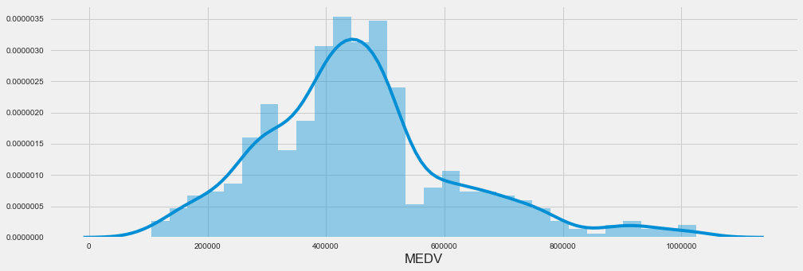


### Implementação: Calcular Estatísticas
Para a sua primeira implementação de código, você vai calcular estatísticas descritivas sobre preços dos imóveis de Boston. Dado que o `numpy` já foi importado para você, use essa biblioteca para executar os cálculos necessários. Essas estatísticas serão extremamente importantes depois para analisar várias estimativas resultantes do modelo construído.

> Na célula de código abaixo, você precisará implementar o seguinte:
- Calcular o mínimo, o máximo, a média, a mediana e o desvio padrão do `'MEDV'`, que está armazenado em `prices`.
  - Armazenar cada cálculo em sua respectiva variável.


```python
np_prices = prices.values
minimum_price = np.min(np_prices)
maximum_price = np.max(np_prices)
mean_price = np.mean(np_prices)
median_price = np.median(np_prices)
std_price = np.std(np_prices)

# Mostrar as estatísticas calculadas
def show_data_set_stats():
    print ("Estatísticas para os dados dos imóveis de Boston:\n")
    print ("Preço mínimo: ${:,.2f}".format(minimum_price))
    print ("Preço máximo: ${:,.2f}".format(maximum_price))
    print ("Preço médio: ${:,.2f}".format(mean_price))
    print ("Preço mediano: ${:,.2f}".format(median_price))
    print ("Desvio padrão dos preços: ${:,.2f}".format(std_price))
    
show_data_set_stats()
```

    Estatísticas para os dados dos imóveis de Boston:
    
    Preço mínimo: $105,000.00
    Preço máximo: $1,024,800.00
    Preço médio: $454,342.94
    Preço mediano: $438,900.00
    Desvio padrão dos preços: $165,171.13
    

### Questão 1 - Observação de Atributos
Para lembrar, estamos utilizando três atributos do conjunto de dados dos imóveis de Boston: 'RM'`, `'LSTAT'` e `'PTRATIO'`. Para cada observação de dados (vizinhança):
- `'RM'` é o número médio de quartos entre os imóveis na vizinhança.
- `'LSTAT'` é a porcentagem de proprietários na vizinhança considerados de "classe baixa" (proletariado).
- `'PTRATIO'` é a razão de estudantes para professores nas escolas de ensino fundamental e médio na vizinhança.

> _Utilizando sua intuição, para cada um dos atributos acima, você acha que um aumento no seu valor poderia levar a um **aumento** no valor do `'MEDV'` ou uma **diminuição** do valor do `'MEDV'`? Justifique sua opinião para cada uma das opções._  
**Dica:** Você espera que um imóvel que tem um valor `'RM'` de 6 custe mais ou menos que um imóvel com valor `'RM'` de 7?


```python
# CORRELACAO ENTRE AS COLUNAS
data.corr()
```


<div>
<style>
    .dataframe thead tr:only-child th {
        text-align: right;
    }

    .dataframe thead th {
        text-align: left;
    }

    .dataframe tbody tr th {
        vertical-align: top;
    }
</style>
<table border="1" class="dataframe">
  <thead>
    <tr style="text-align: right;">
      <th></th>
      <th>RM</th>
      <th>LSTAT</th>
      <th>PTRATIO</th>
      <th>MEDV</th>
    </tr>
  </thead>
  <tbody>
    <tr>
      <th>RM</th>
      <td>1.000000</td>
      <td>-0.612033</td>
      <td>-0.304559</td>
      <td>0.697209</td>
    </tr>
    <tr>
      <th>LSTAT</th>
      <td>-0.612033</td>
      <td>1.000000</td>
      <td>0.360445</td>
      <td>-0.760670</td>
    </tr>
    <tr>
      <th>PTRATIO</th>
      <td>-0.304559</td>
      <td>0.360445</td>
      <td>1.000000</td>
      <td>-0.519034</td>
    </tr>
    <tr>
      <th>MEDV</th>
      <td>0.697209</td>
      <td>-0.760670</td>
      <td>-0.519034</td>
      <td>1.000000</td>
    </tr>
  </tbody>
</table>
</div>


```python
sns.heatmap(data.corr(), cmap='coolwarm', annot=True)
```


    <matplotlib.axes._subplots.AxesSubplot at 0x23fb2bbbf60>


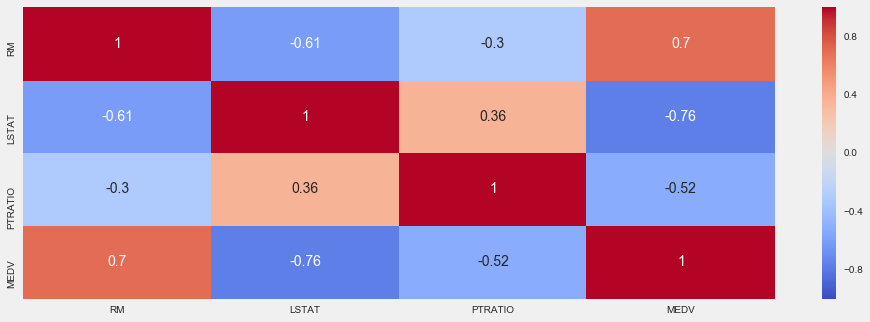


```python
from sklearn.linear_model import LinearRegression

def show_corr(columnName, xlabel, ylabel):
    model = LinearRegression()
    column = data[columnName].reshape(-1,1)
    model.fit(column, prices)
    predictions =  model.predict(column)
    plt.plot(column, predictions, color='red', linewidth=1)
    plt.scatter(column, prices, alpha=0.4, c=prices)
    plt.xlabel(xlabel)
    plt.ylabel(ylabel)
    plt.show()
    
show_corr('PTRATIO',"Students by Teachers Ratio",'Price')
show_corr('LSTAT',"% Low Class Neighbors",'Price')
show_corr('RM',"Media Quartos",'Price')
```

    C:\ProgramData\Anaconda3\lib\site-packages\ipykernel_launcher.py:5: FutureWarning: reshape is deprecated and will raise in a subsequent release. Please use .values.reshape(...) instead
      """
    


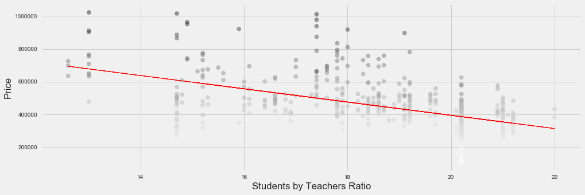


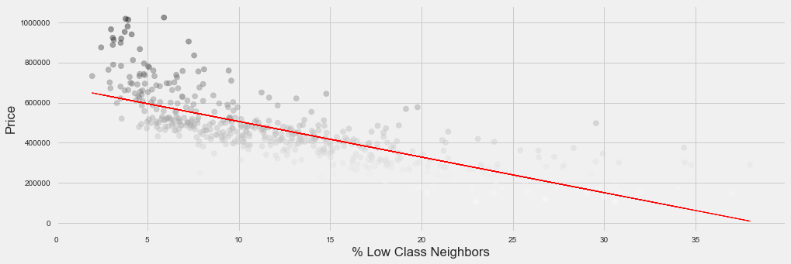


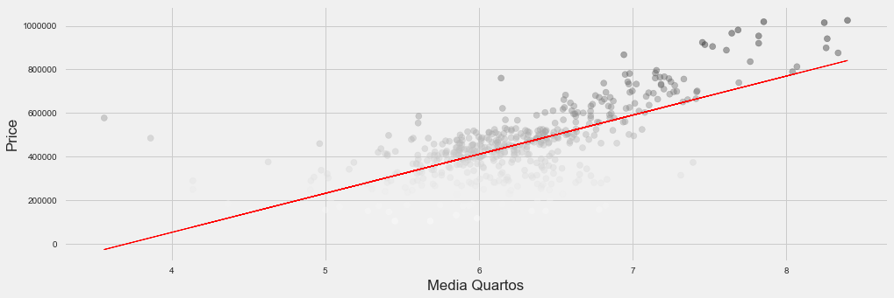


**Resposta: **<br>
Analisando as correlações das colunas RM, LSTAT e PTRATIO com MEDV podemos concluir que:
* Se o RM é maior o preço do imóvel é maior e se o RM é menor o preço do imóvel é menor.<br>- Isso faz sentido, já que é de se esperar que um imóvel com mais quartos seja maior e consequentemente mais caro.
* Se o LSTAT é maior o preço do imóvel é menor e se o LSTAT é menor o preço do imóvel é maior.<br>- Isso também é coorente, pois é de se esperar que exista uma desvalorização do imóvel se ficar localizado em uma área de baixa renda. Para ilustrar isso se pegarmos 2 casas em São Paulo com 5 quartos cada (de uma área em m2 similar) no Morumbi seria de se esperar que as 2 tenha preços similares, porém se compararmos o preço dessas casas com uma outra com as mesmas características porém localizada no Jardim Angela, a casa no Jardim Angela vai ter o valor muito inferior.
* Se o PTRATIO é maior o preço do imóvel é menor e se o PTRATIO é menor o preço do imóvel é maior.<br> - Assim como o LSTAT tem impacto negativo no valor do imóvel (em menores proporções). Uma grande quantidade de alunos por professor nos dá a entender que há um menor escolas na região e/ou em salas de aula lotadas. Isso tem influência no preço de imóveis residenciais, já que a existência de mais escolas perto de uma residência torna mais conveniente para um propenso morador que tenha filhos a compra do imóvel.

----

## Desenvolvendo um Modelo
Na segunda seção deste projeto, você vai desenvolver ferramentas e técnicas necessárias para um modelo que faz estimativas. Ser capaz de fazer avaliações precisas do desempenho de cada modelo através do uso dessas ferramentas e técnicas ajuda a reforçar a confiança que você tem em suas estimativas.

### Implementação: Definir uma Métrica de Desempenho
É difícil medir a qualidade de um modelo dado sem quantificar seu desempenho durante o treinamento e teste. Isso é geralmente feito utilizando algum tipo de métrica de desempenho, através do cálculo de algum tipo de erro, qualidade de ajuste, ou qualquer outra medida útil. Para este projeto, você irá calcular o [*coeficiente de determinação*](https://pt.wikipedia.org/wiki/R%C2%B2), R<sup>2</sup>, para quantificar o desempenho do seu modelo. O coeficiente da determinação para um modelo é uma estatística útil em análise regressa, como se ele frequentemente descrevesse como "good" a capacidade do modelo de fazer estimativas. 

Os valores para R<sup>2</sup> têm um alcance de 0 a 1, que captura a porcentagem da correlação ao quadrado entre a estimativa e o valor atual da **variável alvo**. Um modelo R<sup>2</sup> de valor 0 sempre falha ao estimar a variável alvo, enquanto que um modelo R<sup>2</sup> de valor 1, estima perfeitamente a variável alvo. Qualquer valor entre 0 e 1 indica qual a porcentagem da variável alvo, ao utilizar esse modelo, ele pode ser explicado pelos **atributos**. *Um modelo pode dar também um R<sup>2</sup> negativo, que indica que o modelo não é melhor do que aquele que estima ingenuamente a média da variável alvo.*

> Para a função ‘performance_metric’ na célula de código abaixo, você irá precisar implementar o seguinte:
- Utilizar o `r2_score` do `sklearn.metrics` para executar um cálculo de desempenho entre `y_true` e `y_predict`.
- Atribuir a pontuação do desempenho para a variável `score`.


```python
from sklearn.metrics import r2_score

def performance_metric(y_true, y_predict):
    """ Calcular e retornar a pontuação de desempenho entre 
        valores reais e estimados baseado na métrica escolhida. """
    score = r2_score(y_true, y_predict)
    # Devolver a pontuação
    return score
```

### Questão 2 - Qualidade do Ajuste
Admita que um conjunto de dados que contém cinco observações de dados e um modelo fez a seguinte estimativa para a variável alvo:

| Valores Reais | Estimativa |
| :-------------: | :--------: |
| 3.0 | 2.5 |
| -0.5 | 0.0 |
| 2.0 | 2.1 |
| 7.0 | 7.8 |
| 4.2 | 5.3 |
*Você consideraria que esse modelo foi capaz de capturar a variação da variável alvo com sucesso? Por que ou por que não?* 

> Executar a célula de código abaixo para usar a função `performance_metric’ e calcular o coeficiente de determinação desse modelo.


```python
# Calcular o desempenho deste modelo
y_true = [3, -0.5, 2, 7, 4.2]
y_predict = [2.5, 0.0, 2.1, 7.8, 5.3]
score = performance_metric(y_true, y_predict)
print ("O coeficiente de determinação, R^2, do modelo é {:.3f}.".format(score))

#ploting the values
true_handle = plt.scatter(y_true, y_true, alpha=0.6, color='green', label='true')

#reference line
fit = np.poly1d(np.polyfit(y_true,y_true,1))
lims = np.linspace(min(y_true) - 1, max(y_true) + 1)
plt.plot(lims, fit(lims), alpha= 0.3, color='black')

# plot predic valus
pred_handle =  plt.scatter(y_true, y_predict, alpha=0.6, color='red', label='predicted')

# legend and show
plt.legend(handles=[true_handle, pred_handle], loc='upper left')
plt.show()
```

    O coeficiente de determinação, R^2, do modelo é 0.923.
    


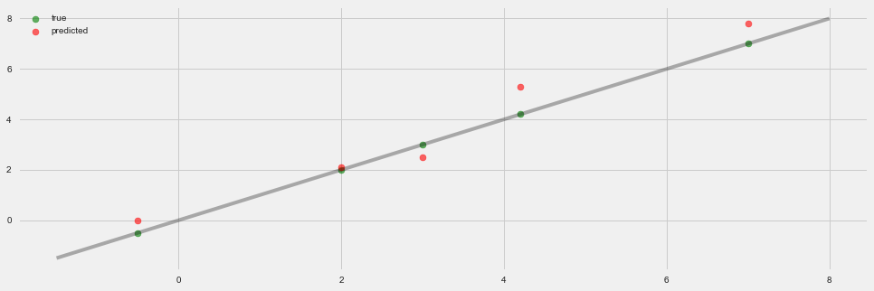


**Resposta:** <br> O R² do modelo é 0,923, isto significa que 92,3% da variável dependente consegue ser explicada pelos regressores presentes no modelo. Então podemos afirmar que este modelo foi capaz de capturar a variação da variável com 92,3% de sucesso.

### Implementação: Misturar e Separar os Dados
Sua próxima implementação exige que você pegue o conjunto de dados de imóveis de Boston e divida os dados em subconjuntos de treinamento e de teste. Geralmente os dados são também misturados em uma ordem aleatória ao criar os subconjuntos de treinamento e de teste para remover qualquer viés (ou erro sistemático) na ordenação do conjunto de dados.

> Para a célula de código abaixo, você vai precisar implementar o seguinte:
- Utilize `train_test_split` do `sklearn.cross_validation` para misturar e dividir os dados de `features` e `prices` em conjuntos de treinamento e teste.
  - Dividir os dados em 80% treinamento e 20% teste.
  - Mude o `random_state` do `train_test_split` para um valor de sua escolha. Isso garante resultados consistentes.
- Atribuir a divisão de treinamento e teste para X_train`, `X_test`, `y_train` e `y_test`.


```python
from sklearn.model_selection import train_test_split

X_train, X_test, y_train, y_test = train_test_split(features,prices,test_size=0.2, random_state=50)

# Êxito
print ("Separação entre treino e teste feita com êxito.")
```

    Separação entre treino e teste feita com êxito.
    

### Questão 3 - Treinamento e Teste
*Qual o benefício de separar o conjunto de dados em alguma relação de subconjuntos de treinamento e de teste para um algoritmo de aprendizagem?*  
> **Dica:** O que pode dar errado se não houver uma maneira de testar seu modelo?

**Resposta: ** <br>Usando subconjuntos de treinamento e de testes podemos validar se o nosso modelo generaliza bem os dados. Caso não seja possível testar nosso modelo, podemos acabar com um modelo que tem uma performance muito boa no treinamento, porém não tem um bom desempenho com dados reais (como no caso do overfiting).

----

## Analisando o Modelo de Desempenho
Na terceira parte deste projeto, você verá o desempenho em aprendizagem e teste de vários modelos em diversos subconjuntos de dados de treinamento. Além disso, você irá investigar um algoritmo em particular com um parâmetro `'max_depth'` (profundidade máxima) crescente, em todo o conjunto de treinamento, para observar como a complexidade do modelo afeta o desempenho. Plotar o desempenho do seu modelo baseado em critérios diversos pode ser benéfico no processo de análise, por exemplo: para visualizar algum comportamento que pode não ter sido aparente nos resultados sozinhos.

### Curvas de Aprendizagem
A célula de código seguinte produz quatro gráficos para um modelo de árvore de decisão com diferentes níveis de profundidade máxima. Cada gráfico visualiza a curva de aprendizagem do modelo para ambos treinamento e teste, assim que o tamanho do conjunto treinamento aumenta. Note que a região sombreada da curva de aprendizagem denota a incerteza daquela curva (medida como o desvio padrão). O modelo é pontuado em ambos os conjuntos treinamento e teste utilizando R<sup>2</sup>, o coeficiente de determinação.  

> Execute a célula de código abaixo e utilizar esses gráficos para responder as questões a seguir.


```python
# Criar curvas de aprendizagem para tamanhos de conjunto de treinamento variável e profundidades máximas
vs.ModelLearning(features, prices)
```


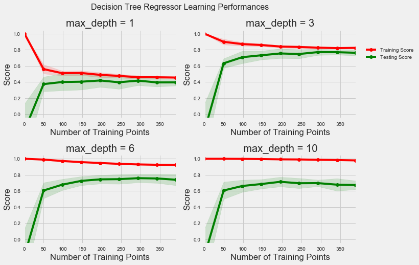


### Questão 4 - Compreendendo os Dados
*Escolha um dos gráficos acima e determine a profundidade máxima para o modelo. O que acontece com a pontuação da curva de treinamento se mais pontos de treinamento são adicionados? E o que acontece com a curva de teste? Ter mais pontos de treinamento beneficia o modelo?*  
> **Dica:** As curvas de aprendizagem convergem para uma pontuação em particular?

**Resposta: **<br>
*Profundidade máxima = 3* <br>
Conforme mais pontos de treinamento são adicionados as curvas de treinamento e de teste convergem para um score de aproximadamente 0,8. Com aproximadamente 200 pontos de treinamento chega-se ao platô, ou seja, o modelo já foi aprendido.<br>A partir desse ponto aumentar o tamanho do conjunto de treinamentos dará redimentos **decrescentes na precisão**. Isso não significa que vai chegar um ponto em que a melhoria será zero, mas a melhoria pode ser extremamente pequena o que deixará a curva quase horizontal e isso acaba *"não justificando os esforço"* por **não trazer um benefício real ao modelo**.

### Curvas de Complexidade
A célula de código a seguir produz um gráfico para um modelo de árvore de decisão que foi treinada e validada nos dados de treinamento utilizando profundidades máximas diferentes. O gráfico produz duas curvas de complexidade – uma para o treinamento e uma para a validação. Como a **curva de aprendizagem**, a área sombreada de ambas as curvas de complexidade denota uma incerteza nessas curvas, e o modelo pontuou em ambos os conjuntos de treinamento e validação utilizando a função `performance_metric`.  

>Execute a célula de código abaixo e utilize o gráfico para responder as duas questões a seguir.


```python
vs.ModelComplexity(X_train, y_train)
```


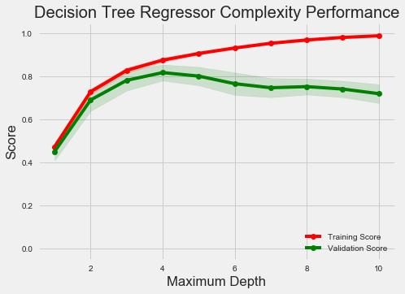


### Questão 5 - Equilíbrio entre viés e variância
*Quando o modelo é treinado com o profundidade máxima 1, será que o modelo sofre mais de viés (erro sistemático) ou variância (erro aleatório)? E o que acontece quando o modelo é treinado com profundidade máxima 10? Quais pistas visuais existem no gráfico para justificar suas conclusões?*  
**Dica:** Como você sabe que um modelo está experimentando viés alto ou variância alta?

**Resposta: **<br>
Alto viés e baixa variância são encontrados quando o modelo é simples demais resultando em Underfiting e seu desempenho não é bom com dados de treinamento e nem de teste.
Baixo viés e alta variância são características de um modelo que apresenta Overfiting no dados de treinamento fazendo com que seu desempenho com os dados de teste seja ruim.<br>
Quando os dados do modelo representado no gráfico é treinado com profundidade máxima de 1 nota-se um resultado muito ruim tanto no treinamento quanto na validação devido ao alto viés sendo um caso de Underfiting. Já com produndidade 10 vemos um resultado bom no treinamento e ruim na validação denotando o Overfiting. <br>

### Questão 6 - Modelo Ótimo de Melhor Suposição
*Qual profundidade máxima (`'max_depth'`) você acredita que resulta em um modelo que melhor generaliza um dado desconhecido? Que intuição te levou a essa resposta?*

**Resposta: **<br>
O ponto de equilíbrio entre viés e variância encontra-se na profundidade 4 para este modelo onde os scores de testes e validação são mais altos e próximos um do outro.

-----

## Avaliando o Desempenho do Modelo
Nesta parte final do projeto, você irá construir um modelo e fazer uma estimativa de acordo com o conjunto de atributos do cliente utilizando um modelo otimizado a partir de `fit_model`.

### Questão 7 - Busca em Matriz
*O que é a técnica de busca em matriz (*grid search*) e como ela pode ser aplicada para otimizar um algoritmo de aprendizagem?*

**Resposta: **<br>
A escolha de um modelo consiste em basicamente 3 passos: <br>
1. Treinar vários modelos (com hiperparâmetro diferentes) com os dados de treinamento
2. Usar os dados de validação para escolher com base em um score (F1 score por exemplo) o melhor modelo
3. Validar o modelo com os dados de teste.<br>
Quando temos um algoritimos que possuem mais de um hiperparâmetro como por exemplo Kernel e Gamma em   Support Vector Machine e precisamos escolher o melhor conjunto de valores para esses hiperparâmetros, fazemos uma tabela com todas as possibilidades (passo 1) para escolher a melhor (passo 2) e validar como os dados de teste (passo 3).<br>
> Como ilustrado na Tabela Abaixo para um algoritimo de **Support Vector Machine**:
<table style="width:100%;text-align:center" border="1">
  <tr>
    <th>Kernel/ Gamma</th>
    <th>Linear</th> 
    <th>Polimomial</th>
  </tr>
  <tr>
    <td>0.1</td>
    <td>0.4</td>
    <td>0.6</td>
  </tr>
  <tr>
    <td>1</td>
    <td style="background:blue;color:white">0.8</td>
    <td>0.3</td>
  </tr>
  <tr>
    <td>10</td>
    <td>0.5</td>
    <td>0.2</td>
  </tr>
</table>

### Questão 8 - Validação Cruzada
*O que é a técnica de treinamento de validação-cruzada k-fold? Quais benefícios essa técnica proporciona para busca em matriz ao otimizar um modelo?*  
**Dica:** Assim como há um raciocínio por trás de utilizar um conjunto de teste, o que poderia dar errado ao utilizar busca em matriz sem um conjunto de validação cruzada?

**Resposta: **<br>
Nunca devemos usar nosso conjunto de teste para treinar o modelo. Entao o ideal é termos um conjunto de validação para tomada de decisão em relação ao modelo, com o valor dos parametros por exemplo. Assim nossos dados ficarão divididos em 3 conjuntos: Treinamento, Validação e Teste<br>
A técnica de validação-cruzada k-fold é um método para reciclarmos nossos dados. O objetivo é estimar o quão preciso o modelo será quando novos dados entrarem. Funciona da seguinte forma:<br>
1. Os dados são quebrados em K subconjuntos mutualmente exclusivos.
2. Treinamos nossos modelos K vezes, cada vez usando um pedaço diferente como conjunto de testes e o restante como conjunto de treinamento.
3. Tiramos uma média dos resultados para escolher o modelo final<br><br>
Essa técnica se ajusta muito bem a utilização da busca em matrix sem um conjunto de validação cruzada, pois ao dividir os dados em conjunto de treinamento e conjunto de testes apenas uma vez o tamanho dos conjuntos fica limitado e ao usar um único conjunto de validação pode ocorrer overfiting.<br><br>
Assim o grande benefício de usar a valização-cruzada k-fold na busca em matriz é que todas as observações são usadas para treinamento e validação, e cada observação é usada para validação uma única vez. Isso nos dá a segurança de usar todo o dataset para treinamento e validação sem correr o risco de superestimar o desempenho do conjunto de validação único que foi selecionado na otmização do modelo.

### Implementação: Ajustar um Modelo
Na sua última implementação, você vai precisar unir tudo o que foi aprendido e treinar um modelo utilizando o **algoritmo de árvore de decisão**. Para garantir que você está produzindo um modelo otimizado, você treinará o modelo utilizando busca em matriz para otimizar o parâmetro de profundidade máxima (`'max_depth'`) para uma árvore de decisão. Esse parâmetro pode ser entendido como o número de perguntas que o algoritmo de árvore de decisão pode fazer sobre os dados antes de fazer uma estimativa. Árvores de decisão são parte de uma classe de algoritmos chamados *algoritmos de aprendizagem supervisionada*.

Para a função `fit_model` na célula de código abaixo, você vai precisar implementar o seguinte:
- Utilize o [`DecisionTreeRegressor`](http://scikit-learn.org/stable/modules/generated/sklearn.tree.DecisionTreeRegressor.html) do `sklearn.tree` para gerar um objeto regressor de árvore de decisão.
  - Atribua esse objeto à variável `'regressor'`.
- Gere um dicionário para `'max_depth'` com os valores de 1 a 10 e atribua isso para a variável `'params'`.
- Utilize o [`make_scorer`](http://scikit-learn.org/stable/modules/generated/sklearn.metrics.make_scorer.html) do `sklearn.metrics` para gerar um objeto de função de pontuação.
  - Passe a função `performance_metric` como um parâmetro para esse objeto.
  - Atribua a função de pontuação à variável `'scoring_fnc'`.
- Utilize o [`GridSearchCV`](http://scikit-learn.org/stable/modules/generated/sklearn.grid_search.GridSearchCV.html) do `sklearn.grid_search` para gerar um objeto de busca por matriz.
  - Passe as variáveis `'regressor'`, `'params'`, `'scoring_fnc'` and `'cv_sets'` como parâmetros para o objeto. 
  - Atribua o objeto `GridSearchCV` para a variável `'grid'`.


```python
from sklearn.tree import DecisionTreeRegressor
from sklearn.metrics import make_scorer
from sklearn.grid_search import GridSearchCV

def fit_model(X, y):
    """ Desempenhar busca em matriz sobre o parâmetro the 'max_depth' para uma 
        árvore de decisão de regressão treinada nos dados de entrada [X, y]. """
    
    # Gerar conjuntos de validação-cruzada para o treinamento de dados
    cv_sets = ShuffleSplit(X.shape[0], n_iter = 10, test_size = 0.20, random_state = 0)

    # TODO: Gerar uma árvore de decisão de regressão de objeto
    regressor = DecisionTreeRegressor()

    # TODO: Gerar um dicionário para o parâmetro 'max_depth' com um alcance de 1 a 10
    params ={'max_depth': list(range(1, 11))}

    # TODO: Transformar 'performance_metric' em uma função de pontuação utilizando 'make_scorer' 
    scoring_fnc = make_scorer(performance_metric)

    # TODO: Gerar o objeto de busca em matriz
    grid = GridSearchCV(estimator=regressor, param_grid=params,scoring=scoring_fnc,cv=cv_sets)

    # Ajustar o objeto de busca em matriz com os dados para calcular o modelo ótimo
    grid = grid.fit(X, y)

    # Devolver o modelo ótimo depois de realizar o ajuste dos dados
    return grid.best_estimator_
```

    C:\ProgramData\Anaconda3\lib\site-packages\sklearn\grid_search.py:43: DeprecationWarning: This module was deprecated in version 0.18 in favor of the model_selection module into which all the refactored classes and functions are moved. This module will be removed in 0.20.
      DeprecationWarning)
    

### Fazendo Estimativas
Uma vez que o modelo foi treinado em conjunto de dados atribuído, ele agora pode ser utilizado para fazer estimativas em novos conjuntos de entrada de dados. No caso do *regressor da árvore de decisão*, o modelo aprendeu *quais são as melhores perguntas sobre a entrada de dados*, e pode responder com uma estimativa para a **variável alvo**. Você pode utilizar essas estimativas para conseguir informações sobre os dados dos quais o valor da variável alvo é desconhecida – por exemplo, os dados dos quais o modelo não foi treinado.

### Questão 9 - Modelo Ótimo
_Qual profundidade máxima do modelo ótimo? Como esse resultado se compara com a sua suposição na **Questão 6**?  

Executar a célula de código abaixo para ajustar o regressor da árvore de decisão com os dados de treinamento e gerar um modelo ótimo.


```python
# Ajustar os dados de treinamento para o modelo utilizando busca em matriz
reg = fit_model(X_train, y_train)

# Produzir valores para 'max_depth'
print ("O parâmetro 'max_depth' é {} para o modelo ótimo.".format(reg.get_params()['max_depth']))
```

    O parâmetro 'max_depth' é 4 para o modelo ótimo.
    

**Resposta: **<br>
A profundidade maxima do modelo ótimo é **4**, sendo o mesmo resultado da suposição que fiz na questão 6.

### Questão 10 -Estimando Preços de Venda
Imagine que você era um corretor imobiliário na região de Boston ansioso para utilizar esse modelo que ajuda os imóveis que seus clientes desejam vender. Você coletou as seguintes informações de três dos seus clientes:

| Atributos | Cliente 1 | Cliente 2 | Cliente 3 |
| :---: | :---: | :---: | :---: |
| Número total de quartos em um imóvel | 5 quartos | 4 quartos | 8 quartos |
| Nível de pobreza da vizinhança (em %) | 17% | 32% | 3% |
| Razão estudante:professor das escolas próximas | 15-to-1 | 22-to-1 | 12-to-1 |
*Qual valor você sugeriria para cada um dos seus clientes para a venda de suas casas? Esses preços parecem razoáveis dados os valores para cada atributo?*  
**Dica:** Utilize as estatísticas que você calculou na seção **Explorando Dados** para ajudar a justificar sua resposta.  

Execute a célula de códigos abaixo para que seu modelo otimizado faça estimativas para o imóvel de cada um dos clientes.


```python
# Gerar uma matriz para os dados do cliente
client_data = [[5, 17, 15], # Cliente 1
               [4, 32, 22], # Cliente 2
               [8, 3, 12]]  # Cliente 3
show_data_set_stats()

# Mostrar estimativas
predicts = reg.predict(client_data)
for i, price in enumerate(predicts):
    print ("\nPreço estimado para a casa do cliente {}: ${:,.2f}".format(i+1, price))
    df = data[(data['MEDV']>price - 10000) & (data['MEDV']<price + 10000)]
    print('Precos Similares no Dataset')
    print(df.head())
    
# ploting
clients = np.transpose(client_data)
for i, feature in enumerate(['RM','LSTAT','PTRATIO']):
    plt.scatter(features[feature], prices, alpha= 0.7, c=prices)
    plt.scatter(clients[i], predicts, color='red', linewidths=2, marker='x', s=200)
    plt.xlabel(feature)
    plt.ylabel('PRICE')
    plt.show()
```

    Estatísticas para os dados dos imóveis de Boston:
    
    Preço mínimo: $105,000.00
    Preço máximo: $1,024,800.00
    Preço médio: $454,342.94
    Preço mediano: $438,900.00
    Desvio padrão dos preços: $165,171.13
    
    Preço estimado para a casa do cliente 1: $404,911.11
    Precos Similares no Dataset
           RM  LSTAT  PTRATIO      MEDV
    9   6.004  17.10     15.2  396900.0
    11  6.009  13.27     15.2  396900.0
    21  5.965  13.83     21.0  411600.0
    35  5.933   9.68     19.2  396900.0
    45  5.682  10.21     17.9  405300.0
    
    Preço estimado para a casa do cliente 2: $212,223.53
    Precos Similares no Dataset
            RM  LSTAT  PTRATIO      MEDV
    362  6.223  21.78     20.2  214200.0
    363  6.968  17.21     20.2  218400.0
    369  4.652  28.28     20.2  220500.0
    371  4.880  30.62     20.2  214200.0
    375  5.036  25.68     20.2  203700.0
    
    Preço estimado para a casa do cliente 3: $938,053.85
    Precos Similares no Dataset
            RM  LSTAT  PTRATIO      MEDV
    217  8.266   4.14     17.4  940800.0
    


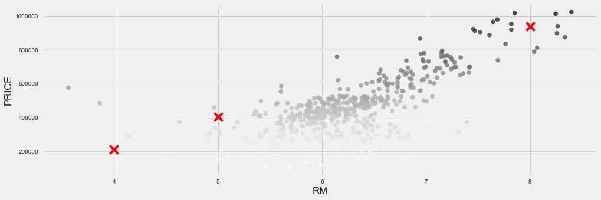


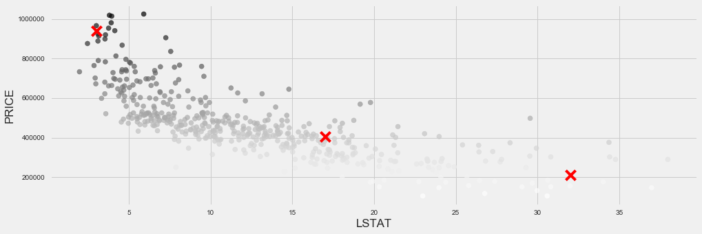


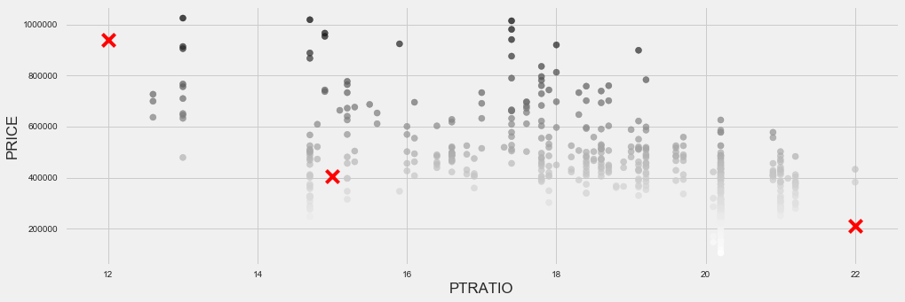


**Resposta: **<br>
Sugeriria os preços que o modelo gerou (supondo que todos os dados que descrevem um imóvel estão presentes em nosso dataset e são avaliados em nosso modelo). Se analisarmos os dados estatístiscos e as features dos imóveis no dataset com valores similares aos preditos, pela intuição podemos ver que o preço predito se ajusta bem as features.

### Sensibilidade
Um modelo ótimo não é necessariamente um modelo robusto. Às vezes, um modelo é muito complexo ou muito simples para generalizar os novos dados. Às vezes, o modelo pode utilizar um algoritmo de aprendizagem que não é apropriado para a estrutura de dados especificado. Outras vezes, os próprios dados podem ter informação excessiva ou exemplos insuficientes para permitir que o modelo apreenda a variável alvo – ou seja, o modelo não pode ser ajustado. Execute a célula de código abaixo para rodar a função `fit_model` dez vezes com diferentes conjuntos de treinamento e teste para ver como as estimativas para um cliente específico mudam se os dados foram treinados.


```python
vs.PredictTrials(features, prices, fit_model, client_data)
```

    Trial 1: $391,183.33
    Trial 2: $424,935.00
    Trial 3: $415,800.00
    Trial 4: $420,622.22
    Trial 5: $418,377.27
    Trial 6: $411,931.58
    Trial 7: $399,663.16
    Trial 8: $407,232.00
    Trial 9: $351,577.61
    Trial 10: $413,700.00
    
    Range in prices: $73,357.39
    

### Questão 11 - Aplicabilidade
*Em poucas linhas, argumente se o modelo construído deve ou não ser utilizado de acordo com as configurações do mundo real.*  
**Dica:** Algumas questões para responder:
- *Quão relevante dados coletados em 1978 podem ser nos dias de hoje?*
- *Os atributos presentes são suficientes para descrever um imóvel?*
- *Esse modelo é robusto o suficiente para fazer estimativas consistentes?*
- *Dados coletados em uma cidade urbana como Boston podem ser aplicados para uma cidade rural?*

**Resposta: **<br>
O modelo construído **não** deve ser utilizado para o mundo real.<br>
Primeiramente o que era relevante em 1978 pode não ser tão relevante hoje. Hoje itens como automação residencial, disponibilidade de sinal de internet e outros não existiam na época e podem influenciar o preço de um imóvel hoje.<br>
Também os atributos presentes não são suficientes para descrever um imóvel, outros itens como vagas de garagem, piscina e banheiros por exemplo são impactantes no preço e descrição de um imóvel e não estão presentes.<br>
Se considerarmos que as features presentes no dataset são suficentes e com um dataset de treinamento maior, esse modelo poderia fazer estimativas consistentes. Mas no mundo real não.<br>
Da mesma forma os dados para localidades urbanas não podem ser aplicados em uma zona rural, são cenários completamente diferentes.
